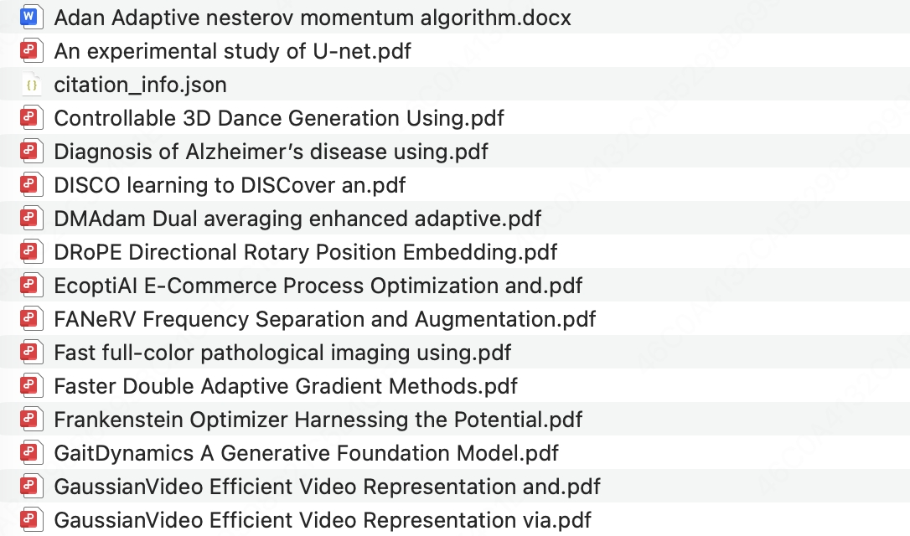
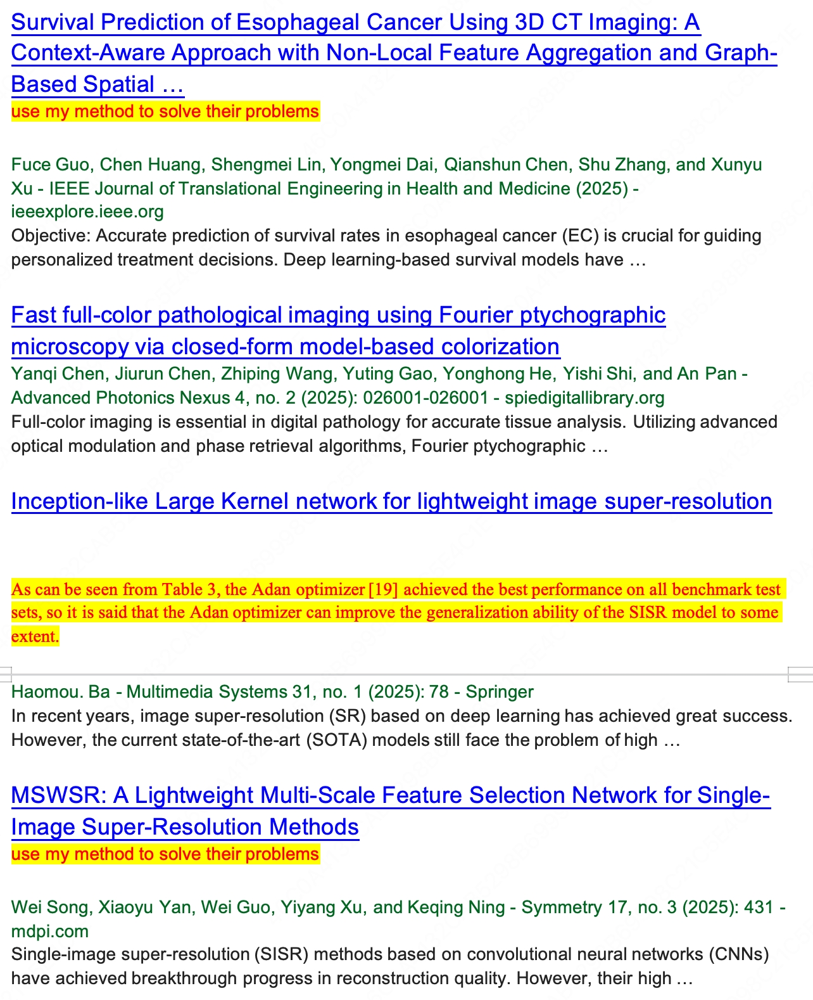

# CiteGen

> **CiteGen** 是为 ZERO Lab 设计的一套**引用管理与评论分析工具链**，用于简化论文引用的收集、整理与分析流程，服务于学术写作与相关研究工作。


## 安装指南 📥

```shell
git clone https://github.com/chenhengzh/CitationGenerator.git
cd CiteGen

# 创建虚拟环境（推荐）
conda create -n citegen python=3.10
conda activate citegen

# 安装依赖
pip install -r requirements.txt
```


## 配置说明 ⚙️

请复制`config_template.py` 为`config.py`，在使用前，需要根据实际情况修改 `config.py` 中的相关字段：

- `author_id`：Google Scholar 作者 ID（用于按作者维度爬取）
- `author_name`：作者姓名（用于生成分工报告等）
- `paper_list`：论文标题列表（用于按论文列表维度爬取）
- `API_KEY`：SerpApi 密钥（用于 Google Scholar 搜索）
- `DEEPSEEK_API_KEY`：DeepSeek API 密钥（用于引用分析）
- `start_year` / `end_year`：爬取论文的年份范围
- `num_ls`：每批爬取的引用数量（步长）

如无特殊需求，建议尽量保持默认配置。


## 使用指南 🚀

整体推荐流程为：

1. 管理员按作者维度预爬取引用并生成分工报告（可选）
2. 各成员按分工爬取被引信息
3. 自动下载并手动补齐PDF，生成 Word 报告
4. 运行评论分析脚本，生成结构化分析结果

### Step 0（可选）：管理员按作者预爬取

用于快速获取某位作者全部论文的引用情况，并生成分工报告：

```shell
python step1_spider.py --mode author
python author_docx_gen.py
```

### Step 1：按论文列表爬取引用信息

各成员根据分工，按论文爬取被引信息：

```shell
python step1_spider.py --mode paper
```

爬取结果将保存在 `paper_list/` 目录下，每篇论文对应一个子文件夹，内容包括：

- `citation_info.json`：该论文的被引信息

### Step 2：生成 Word 报告

**Step 2.1：PDF 自动下载 + 文档生成**

```shell
python step2_docx_gen.py
```

会根据 `citation_info.json` 自动尝试下载引用论文 PDF，并生成原始 Word 报告：


**Step 2.2：辅助手动下载 PDF**

```shell
streamlit run manual_download_helper.py
```

对于未能自动下载的引用文献，可启动手动下载助手，用于：

- 自动移动下载的 PDF 文件到指定目录
- 自动修改文件名


**Step 2.3：基于本地 PDF 更新文档**

在手动补全 PDF 之后，可使用：

```shell
python step2_docx_gen.py --no-pdf
```

此模式不会再尝试联网下载，只会根据当前已存在的 PDF 文件更新文档链接。  
生成的 Word 报告将保存在对应论文文件夹中。

### Step 3：引文评论分析

使用大模型对引用文章进行评论分析，生成结构化的分析结果：

```shell
python step3_analyze.py
```

该步骤将会：

- 读取论文 PDF 文件
- 提取引用片段及其上下文
- 使用配置中的大模型（如 DeepSeek）分析引用关系
- 将分析结果以 JSON 形式保存在各论文目录下的 `comment_analysis/` 目录中

最后，请人工审核分析结果，确保质量后再填入报告。


## 最终效果 📂📄

对于每一篇目标论文，CiteGen 会生成一个独立的文件夹，统一管理其被引文献和汇总报告。整体结构如下所示：

```text
<Paper_Name>/
├── *.pdf
│   └── 引用该论文的所有文献 PDF 文件
├── report.docx
    └── 自动生成的 Word 引用分析报告
````




Word 报告的示例如下所示：



## 致谢 🙏

CiteGen 的部分实现参考了
[CitationAnalysis](https://github.com/xiongyingfei/CitationAnalysis/)
项目中的相关代码与设计思路，特此致谢该项目的开源贡献。


