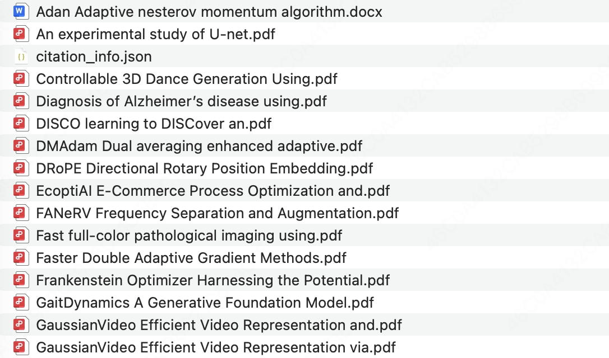
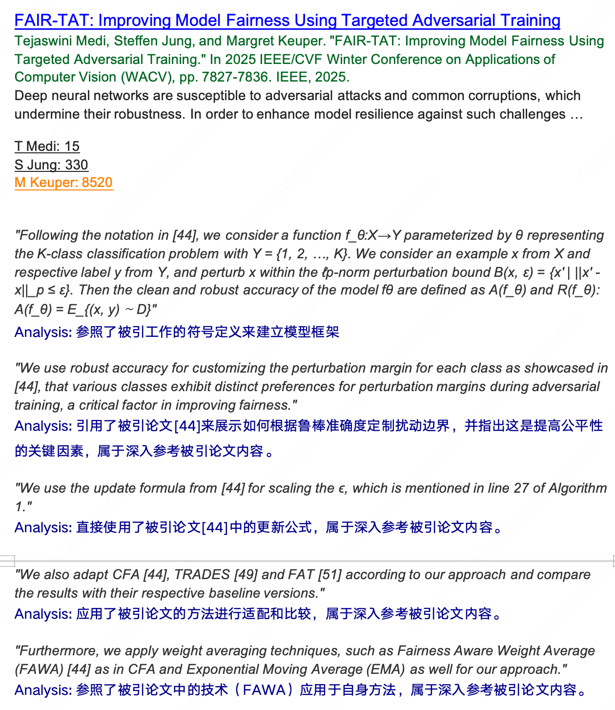

# CiteGen

> **CiteGen** 是为 ZERO Lab 设计的一套**引用管理与评论分析工具链**，用于简化论文引用的收集、整理与分析流程，服务于学术写作与相关研究工作。

## ✨ 效果演示

### 1. 自动生成的文件结构
CiteGen 会自动整理下载的 PDF 和生成的分析文件，保持工作区井井有条：



### 2. 生成的引用报告示例
最终生成的 Word 报告包含详细引用数据与 AI 评论分析：




## 🛠️ 安装指南

### 1. 克隆仓库
```shell
git clone https://github.com/chenhengzh/CitationGenerator.git
cd CiteGen
```

### 2. 环境配置
推荐使用 Conda 创建独立环境：
```shell
conda create -n citegen python=3.10
conda activate citegen
```

### 3. 安装依赖
```shell
pip install -r requirements.txt
```

---

## ⚙️ 配置说明

使用前请先复制模板文件：
```shell
cp config_template.py config.py
```

然后修改 `config.py` 中的关键配置：

- **基础配置**
  - `SERP_API_KEY`: SerpApi 密钥（用于 Google Scholar 搜索）
  - `start_year` / `end_year`: 爬取引用的年份范围
  - `num_ls`: 每次批量爬取的引用数量

- **模式配置**
  - `author_id`: Google Scholar 作者 ID（用于**作者模式**）
  - `author_name`: 作者姓名（用于生成文件名等）
  - `paper_list`: 目标论文标题列表（用于**论文列表模式**）

- **高级配置**
  - `DEEPSEEK_API_KEY`: DeepSeek API 密钥（用于 AI 引用评论分析）
  - `ANALYSIS_MODEL`: 分析使用的模型配置（默认使用 `deepseek_short`）

---

## 🚀 使用指南

CiteGen 的标准工作流分为以下四个步骤：

### Step 1：爬取引用信息

根据需求选择以下两种模式之一：

**模式 A：按论文列表爬取（推荐）**
在 `config.py` 的 `paper_list` 中填入需要爬取的论文标题，然后运行：
```shell
python step1_spider.py --mode paper
```
> 结果将保存至 `paper_list/<论文标题>/citation_info.json`。

**模式 B：按作者爬取（管理员用）**
获取某位作者在指定年份范围内的所有有引用的论文列表：
```shell
python step1_spider.py --mode author
```
> 生成的结果保存至 `author_info/` 目录。
> *注：如需生成分工 Word 文档，请运行 `python author_docx_gen.py`（需根据实际生成的 JSON 文件名修改脚本内的路径）。*

### Step 2：下载 PDF 原文

**2.1 自动下载**
尝试自动下载所有爬取到的引用文献 PDF：
```shell
python step2_pdf_download.py
```

**2.2 辅助手动下载**
对于自动下载失败的文献，使用 Streamlit 助手进行手动补全：
```shell
streamlit run manual_download_helper.py
```
> 助手功能：
> - 自动列出缺失 PDF 的引用
> - 提供下载链接
> - 一键将下载文件夹中的最新 PDF 归档并重命名到对应目录

### Step 3：AI 引用分析

利用大模型（如 DeepSeek）读取 PDF 内容，分析引用上下文与评论：
```shell
python step3_analyze.py
```
> 分析结果将以 JSON 格式保存在各论文目录下的 `comment_analysis/` 文件夹中。

### Step 4：生成最终报告

汇总引用信息与评论分析结果，生成 Word 报告：
```shell
python step4_docx_gen.py
```
> 最终报告 `<title>.docx` 将生成在各论文的文件夹中。

---

## 📂 目录结构示例

```text
CiteGen/
├── paper_list/
│   ├── <论文标题>/
│   │   ├── citation_info.json       # 引用元数据
│   │   ├── *.pdf                    # 引用文献 PDF
│   │   ├── comment_analysis/        # AI 分析结果
│   │   │   └── <引用文献名>.json
│   │   └── <title>.docx             # 最终生成的分析报告
├── author_info/                     # 作者模式生成的中间文件，也可用于辅助评论分析
├── config.py                        # 项目配置文件
├── step1_spider.py                  # 步骤1：爬虫脚本
├── step2_pdf_download.py            # 步骤2：下载脚本
├── step3_analyze.py                 # 步骤3：分析脚本
├── step4_docx_gen.py                # 步骤4：报告生成脚本
└── manual_download_helper.py        # 辅助下载工具
```

## 🙏 致谢

本项目部分实现参考了 [CitationAnalysis](https://github.com/xiongyingfei/CitationAnalysis/) 的相关代码和设计思路，特此致谢。
